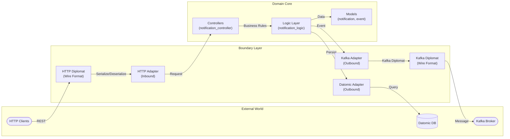

# EventDispatch

<p align="center">
  
</p>

EventDispatch is an event-driven notification orchestration service built with Clojure, Kafka, and Datomic. It exposes a REST API to create and manage notifications, publishes events to Kafka for asynchronous processing, and persists an immutable delivery history in Datomic for auditing and analytics.

## Overview

EventDispatch handles high-volume event streams by:

- Receiving events from multiple producers
- Distributing them through load balancers
- Processing them asynchronously via Kafka
- Storing an immutable history in Datomic

## Architecture

EventDispatch follows the Hexagonal Architecture (Ports & Adapters) pattern, which promotes decoupling and testability:



### Design Principles

- **Models**: Pure domain entities representing business concepts
- **Logic**: Business rules and orchestration logic
- **Controllers**: Application entry points that coordinate logic
- **Diplomats**: Handle serialization/deserialization of wire formats
- **Adapters**: Implement ports to communicate with external systems
- **Ports**: Protocols that define contracts between domain and adapters

## Getting Started

### Prerequisites

- Java 11 or higher
- Clojure 1.10+
- Kafka 2.8+
- Datomic

### Installation

```bash
git clone https://github.com/Ryanditko/EventDispatch.git
cd EventDispatch
lein deps
```

## Development

```bash
lein run
```

## License

This project is licensed under the MIT License.
